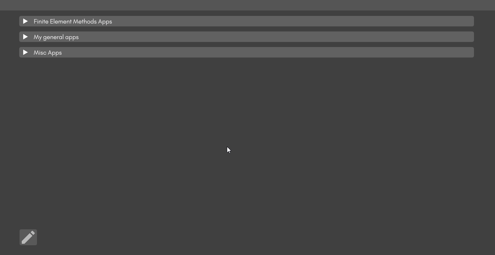

# MultiPy



<h3>About</h3>

MultiPy is a graphical user interface built using [Dear PyGui Python GUI Framework](https://pypi.org/project/dearpygui/) that lets you conveniently keep track of your python scripts for personal use or showcase by loading and grouping them into categories. It allows you to either run each script individually or together with just one click.

You can choose a name for your categories and scripts, indicate whether your script requires a virtual environment to run and select the virtual environment you need, choose whether you want the command prompt to open up, and also choose a thumbnail if you would like to present your work better.

<h3>Features:</h3>

1. Categorize all scripts
2. Add multiple scripts in each category
3. Select virtual environment if required
4. Choose whether you want an instance of cmd to open up
4. Set a thumbnail for better presentation
5. Run scripts individually
6. Run all scripts in a category at once
7. Configure all the script details after the script has been added 
8. Switch to view-only mode to showcase your apps
9. Save your dashboard and open it later

<H3>Instructions</H3>

<b>Important note: MultiPy has only been tested on Windows 10 Operating System.</b>

1. Make sure you have Python 3.6 or later version installed and working
   
2. Clone the repo:

```git clone https://github.com/RahulShagri/MultiPy.git```

3. Install prerequisites using pip. <b>Do NOT install it in a virtual environment. This is to make sure MultiPy can use all the packages for scripts that use globally installed packages</b>:

```pip install -r requirements.txt```

4. Run the <i>MultiPy.py</i> file to start the application
5. Ensure you enter unique names for each category
6. Ensure you enter unique names for each script within a category. Choosing a name is optional. If left blank, the script file name will be chosen as the script name
7. If your script uses a virtual environment, then select the checkbox and find the "activate.bat" file, which can be found in the "Scripts" folder in the virtual environment root folder
8. Choosing a thumbnail is optional. A default thumbnail will be used if left blank

<h3>Demonstration</h3>

<h4>Add and delete categories</h4>


<h4>Add and delete scripts</h4>


<h4>Run scripts and switch to view-only mode</h4>


