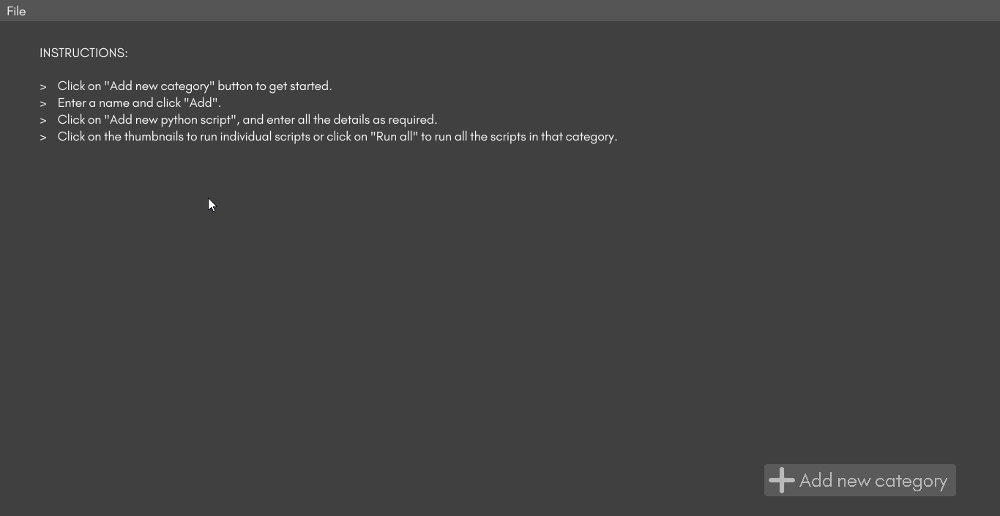
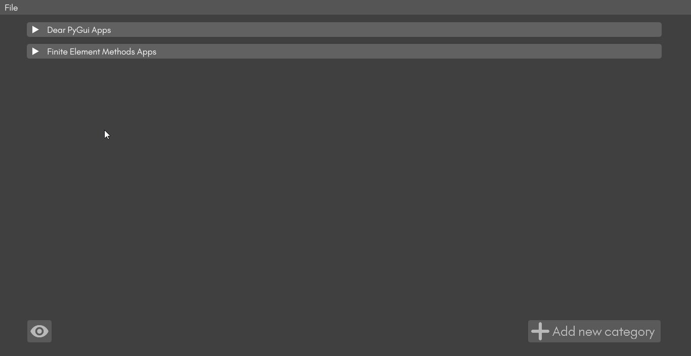

# MultiPy

MultiPy lets you conveniently keep a track of your python scripts for personal use or showcase by loading and grouping them into categories. It allows you to either run each script individually or together with just one click.

You can choose a name for your categories and script, indicate whether your script requires a virtual environment to run and select the virtual environment you need, and also choose a thumbnail if you like to present your work better.

<h3>Features:</h3>

1. Categorize all scripts
2. Add multiple scripts in each category
3. Select virtual environment if required
4. Set a thumbnail for better presentation
5. Run scripts individually
6. Run all scripts at once
7. Switch to view-only mode to showcase your apps
8. Save your dashboard and open it later

<h3>Demonstration</h3>

<h4>Add and delete categories</h4>

<h4>Add and delete scripts</h4>

<h4>Run scripts and switch to view-only mode</h4>

